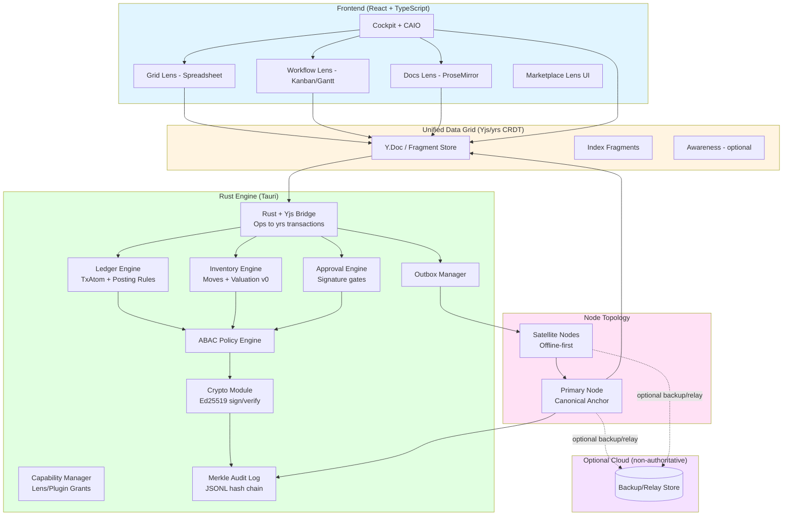
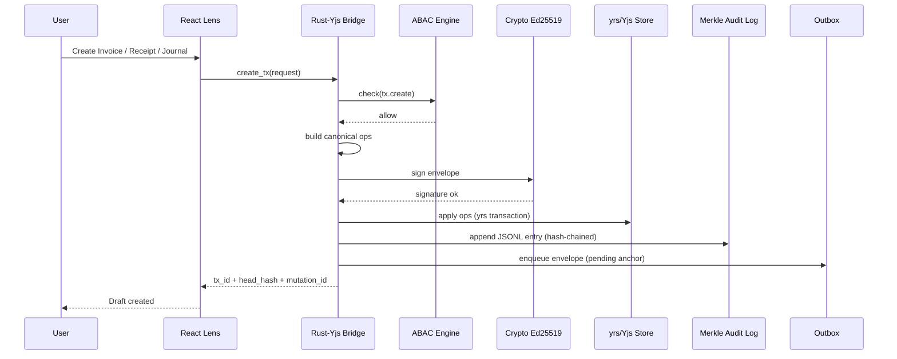
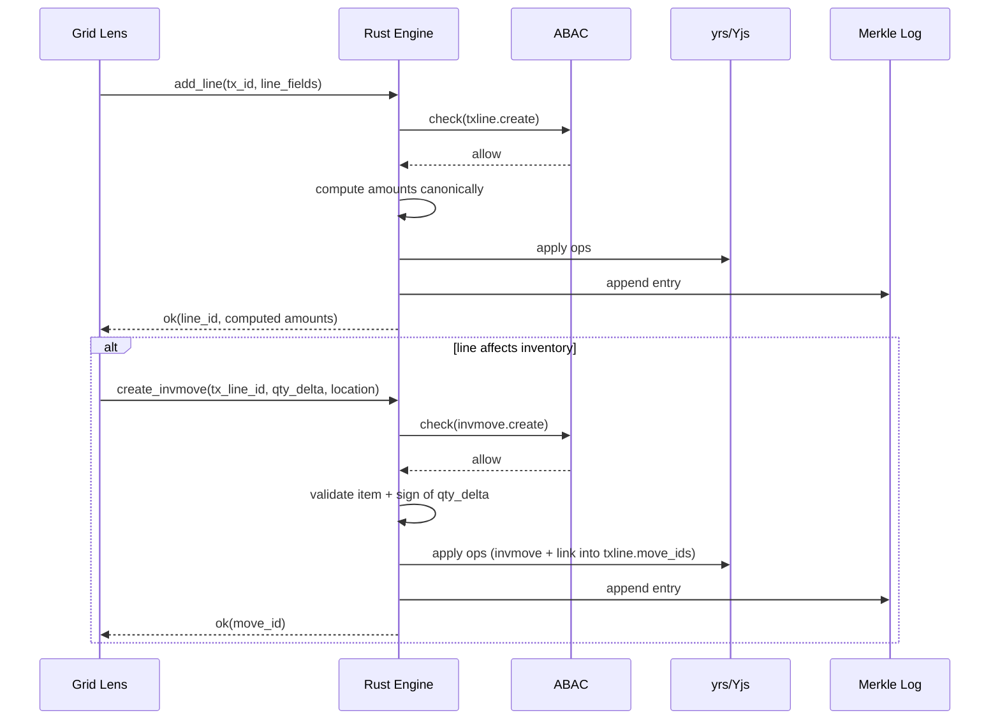
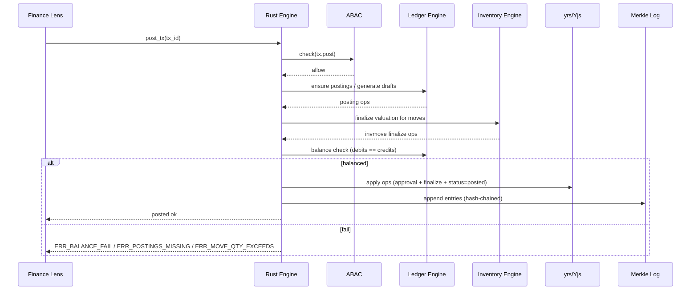
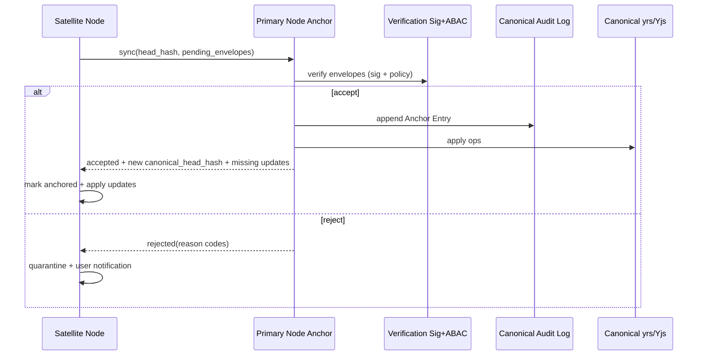

# Corngr-ERP Architecture v1 (Antigravity Spine)

## System Overview

Corngr-ERP is a **local-first, cryptographically verifiable ERP-Grid** that replaces file workflows and "syncing modules" with a **Unified Data Grid** of CRDT fragments (Yjs/yrs) and a **Signed Reality** audit chain.

The architecture is built on three core principles:

1. **Local-First Truth** — All business operations (transactions, inventory moves, approvals) commit locally first. Sync improves availability, not correctness.
2. **Zero-Trust, Signed Reality** — Every meaningful state change is a signed mutation (Ed25519) and becomes part of a Merkle-chained audit log. Trust is mathematical, not administrative.
3. **Performance-Optimized Lenses + Capabilities** — The UI is "Lenses over atoms" (Grid, Workflow, Docs, Cockpit). Capability grants (tokens) accelerate safe access for Lenses/Plugins — without bypassing posting/approval controls.

---

## Technology Stack

### Frontend

| Technology | Role |
|---|---|
| **React 18** | UI framework |
| **TypeScript** | Type-safe development |
| **Canvas/WebGL** | High-performance grid + cockpit visuals |
| **ProseMirror** | Document Lens (invoices, POs, notes) |
| **Yjs** | CRDT state model for fragments/atoms and doc collaboration |

### Backend (Edge-Native)

| Technology | Role |
|---|---|
| **Tauri 2** | Desktop/mobile shell + IPC bridge |
| **Rust** | Security-critical logic + business rules + persistence |
| **yrs (Rust Yjs)** | Backend CRDT state integration |
| **Ed25519-dalek** | Cryptographic signing/verification |
| **Local LLM runtime** *(Phase A optional)* | Candle / llama-edge for on-device inference |

### Persistence (Local)

| Store | Description |
|---|---|
| **CRDT Store** | Local fragment state (yrs/Yjs updates + snapshots) |
| **Outbox** | Pending signed mutation envelopes awaiting anchoring |
| **Merkle Audit Log (JSONL)** | Append-only, hash-chained, verifiable timeline |
| **Key Storage** | OS keychain/secure enclave when available (fallback: encrypted local store) |

### Optional Cloud (Phase B/C)

- **Backup/Relay (non-authoritative):** e.g., Supabase or equivalent
- **Note:** Cloud is **never** the source of truth; it may store encrypted backups, checkpoints, and relay messages.

---

## Architecture Diagram



---

## Data Model Orientation (Post-File)

Corngr-ERP does not store "ERP modules" as separate databases. It stores:

| Atom / Fragment | Description |
|---|---|
| **Transaction Atoms (TxAtom)** | Header + business lines + postings + links |
| **Inventory Move Atoms** | Physical qty deltas linked to tx lines |
| **Approval Atoms** | Signature references gating status transitions |
| **Index Fragments** | Lens performance indexes (engine-only writes) |

Everything is addressable fragments in a shared CRDT grid — Lenses render different views over the same state.

---

## Data Flows

### 1) Create Transaction (local-first, signed)



### 2) Add Line + Create Inventory Move (offline-friendly)



### 3) Post Transaction ("post ceremony" with approvals + invariants)



### 4) Primary ↔ Satellite Sync (anchoring)



---

## Capability Token System (ERP-Ready)

Capability tokens grant **Lens/Plugin permissions** with least privilege. They do **not** replace approvals or posting gates.

### Token Structure

```typescript
interface CapabilityToken {
  token_id: string;           // ULID or UUID
  issuer_pubkey: string;      // org/authority key
  subject_asset_id: string;   // lens/plugin id
  scope: {
    read?: string[];          // e.g., ["ledger", "inventory"]
    propose?: string[];       // e.g., ["posting_suggestions", "reorder"]
    write?: string[];         // rare, tightly scoped
  };
  expires_at_ms: number;
  signature: string;          // Ed25519 over canonical token bytes
}
```

### Rules

- Tokens are **capability grants**, not "ABAC bypass."
- High-risk actions (posting/reversal/permission changes) always require ABAC evaluation **and** appropriate approval signatures.

---

## Security Model (ERP Actions)

**Domains:** `tx` · `ledger` · `inventory` · `approvals` · `marketplace` · `export`

**Key actions:** `tx.create` · `tx.edit` · `tx.status.transition` · `txline.create/edit/delete` · `invmove.create/finalize` · `posting.create/finalize` · `approval.sign` · `tx.post` · `tx.reverse` · `capability.grant` · `asset.install`

### Example Role Defaults

| Role | Draft Tx | Create Moves | Generate Postings | Sign Approvals | Post Tx | Reverse |
|---|---|---|---|---|---|---|
| Staff | ✅ | ✅ | ❌ | ❌ | ❌ | ❌ |
| Manager | ✅ | ✅ | ⚠️ threshold | ✅ approve | ⚠️ threshold | ❌/⚠️ |
| Finance | ✅ | ✅ | ✅ | ✅ approve/post/reverse | ✅ | ✅ |
| Owner/Admin | ✅ | ✅ | ✅ | ✅ | ✅ | ✅ |
| Auditor | Read-only | Read-only | Read-only | ❌ | ❌ | ❌ |

---

## Threat Model

| Threat | Example | Impact | Mitigation |
|---|---|---|---|
| **Unauthorized posting** | Staff tries to post invoices | Financial integrity loss | ABAC + approval atoms + signature gates; engine-only posting finalization |
| **Tampering with history** | Modify local audit JSONL | Audit invalidation | Merkle hash chain verification; integrity badge; re-verify on load/sync |
| **Replay attack** | Re-submit old envelope | Duplicate entries | Mutation ID uniqueness + lamport monotonic checks + replay cache |
| **Key compromise** | Stolen laptop key | Unauthorized approvals | Key revocation propagation; device trust; optional multi-sig (Phase B) |
| **Plugin exfiltration** | Marketplace plugin reads ledger | Data leakage | Capability manifests + sandboxed WASM + no key access + network disabled by default |
| **Policy drift across nodes** | Satellite policy outdated | Inconsistent authorization | Primary is policy anchor; rejects invalid envelopes; satellites quarantine |
| **Clock manipulation** | Fake timestamps | Audit confusion | Lamport clock ordering; timestamps informational; anchor time recorded on Primary |
| **Partial sync divergence** | Some nodes offline | Operational inconsistency | CRDT convergence + anchored chain; UI shows anchor status and node health |

---

## Performance Optimisations (ERP-Grid)

1. **Local commit fast-path** — Apply yrs ops locally first for sub-16ms "feel." Persist envelopes and apply state immediately; anchoring happens asynchronously.
2. **Index fragments (engine-only)** — Maintain lightweight indexes (`tx_by_time`, `postings_by_account`, `moves_by_item`) so Lenses query fast without scanning whole state.
3. **Checkpoints (Phase B)** — Periodic snapshots/checkpoints to accelerate time-travel reconstruction and large-history loads.

---

## Testing Strategy

### Rust Tests (Engine / Bridge / Invariants)

```rust
#[test]
fn test_tx_post_balance_invariant() {
    // Given a tx with postings, ensure sum(debits) == sum(credits) or ERR_BALANCE_FAIL.
}

#[test]
fn test_invmove_qty_sign_matches_inventory_effect() {
    // Receipt must be positive, issue must be negative, else ERR_INVENTORY_EFFECT_MISMATCH.
}

#[test]
fn test_post_requires_approval() {
    // approved->posted requires post approval or ERR_APPROVAL_MISSING.
}

#[test]
fn test_merkle_chain_tamper_detection() {
    // Modify an audit entry and verify integrity check fails.
}

#[test]
fn test_replay_protection() {
    // Same mutation_id or lamport rewind triggers ERR_REPLAY_MUTATION_ID / ERR_LAMPORT_REWIND.
}
```

### TypeScript Tests (Lenses / UI Behaviours)

```typescript
describe("Grid Lens", () => {
  it("renders tx lines and updates reactively from Yjs fragments");
  it("shows anchor status badges and quarantine notifications");
});

describe("Cockpit", () => {
  it("drill-to-source opens the correct tx/posting/approval chain");
});
```

### Manual / Scenario Testing (Must-Pass)

| # | Scenario | Pass Criteria |
|---|---|---|
| 1 | **Offline warehouse flow** | Create inv moves offline → reconnect → anchor → cockpit updates |
| 2 | **Posting ceremony** | Missing approval → correct error; sign → post succeeds |
| 3 | **Audit drill-down** | Click a number → signature + mutation + lineage displayed |
| 4 | **Tamper test** | Modify audit file → integrity badge fails immediately |
| 5 | **Policy change** | Primary revokes role/key → satellite sync → rejected + quarantined |
| 6 | **Large import** | Shatter CSV/Excel → postings generated → post works |

---

## Deployment

### Desktop (Primary & Satellite)

```bash
npm run tauri build
```

Produces platform installers: macOS `.dmg` · Windows `.msi` · Linux `.AppImage` / `.deb`

### Node Role Configuration

- **Primary Node:** Enable "Anchor mode" (always-on service + canonical audit chain)
- **Satellite Node:** Default mode (offline-first + outbox + sync client)

### Optional Cloud (Phase B/C)

- Enable encrypted backup/checkpoint uploads
- Enable relay messaging if needed
- **Never** rely on cloud for correctness

---

## Key Management

- **Actor Keys:** Created per user; stored in OS keychain/secure enclave when possible
- **Device Keys (optional):** Identify device; useful for trust posture and revocation
- **Revocation:** Key revocation is a signed policy update that propagates to nodes; Primary enforces

---

## Future Enhancements

### Phase B: Operational Hardening

- Checkpoints/snapshots for faster time travel
- Stronger inventory valuation methods (FIFO/Weighted Avg with reconciliation)
- Admin console for key/device lifecycle + diagnostics
- Optional cloud backup/relay (non-authoritative)

### Phase C: Ecosystem

- Marketplace (Lens Store): industry lenses + WASM logic plugins + CAIO personas
- Developer signing + capability manifests + private registries
- Plugin SDK with strict sandbox rules and proposal-first default

---

## References

- Tauri documentation
- Yjs documentation
- yrs (Rust Yjs) project docs
- Ed25519 specification resources
- NIST ABAC guidance (SP 800-162)

---

*See also: [PRD.md](./PRD.md) · [SKILLS.md](./SKILLS.md) · [TECHNICAL_BLUEPRINT.md](./TECHNICAL_BLUEPRINT.md)*

**Last Updated:** 27 February 2026  
**Version:** Corngr-ERP Architecture v1 (Phase A Baseline)
