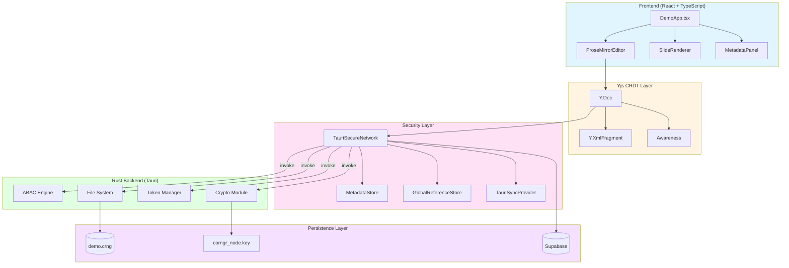
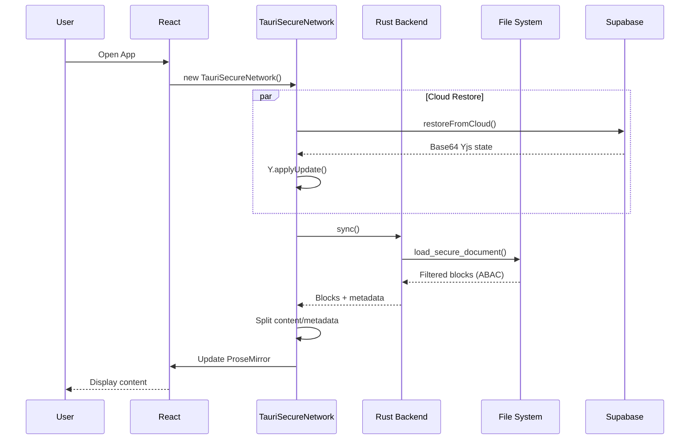
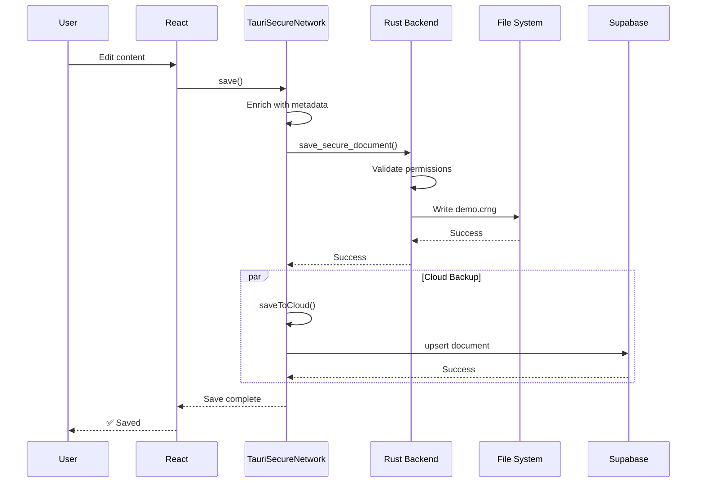
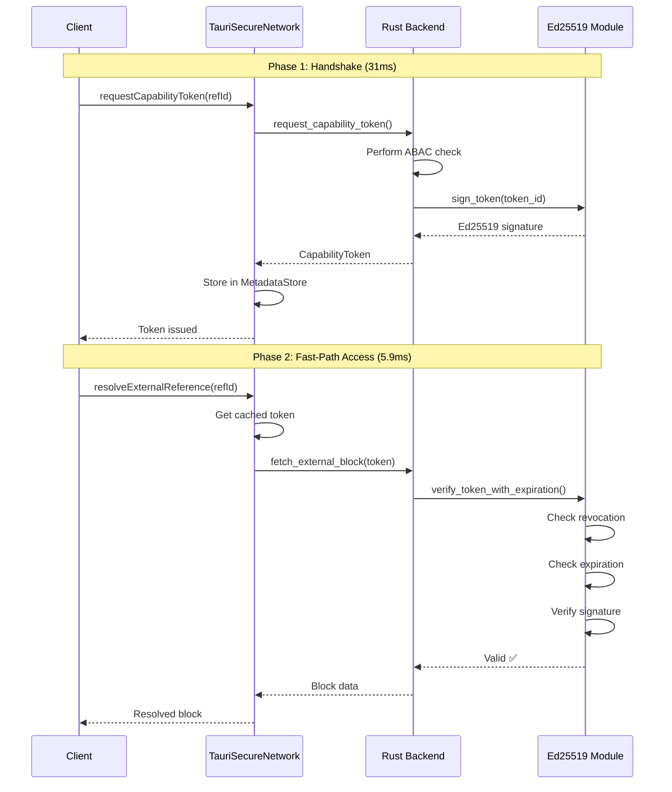

# Corngr Architecture

## System Overview

Corngr is a local-first, security-focused document editor with cloud backup and real-time collaboration capabilities. The architecture is built on three core principles:

1. **Local-First**: All data operations complete locally before syncing to cloud
2. **Zero-Trust Security**: Every access request is validated cryptographically
3. **Performance-Optimized**: Capability tokens enable 20x faster transclusion

---

## Technology Stack

### Frontend
- **React 18**: UI framework
- **ProseMirror**: Rich text editor with collaborative editing
- **Yjs**: CRDT for conflict-free collaborative editing
- **TypeScript**: Type-safe development

### Backend
- **Tauri 2**: Rust-based desktop app framework
- **Rust**: Systems programming for security-critical operations
- **Ed25519-dalek**: Cryptographic signing library

### Cloud
- **Supabase**: PostgreSQL database with real-time subscriptions
- **Row Level Security (RLS)**: Database-level access control

---

## Architecture Diagram



---

## Data Flow

### 1. Document Loading



### 2. Document Saving



### 3. Capability Token Flow



---

## Security Model

### ABAC (Attribute-Based Access Control)

The system uses a multi-layered ABAC model:

```rust
fn check_access(user: &User, block: &Block, action: &str) -> bool {
    // 1. Admin Override
    if user.role == "admin" { return true; }
    
    // 2. Action Capabilities (Role-Based)
    if action == "write" && user.role != "editor" { return false; }
    
    // 3. ACL Check (Resource-Level)
    if !block.acl.contains(user.role) { return false; }
    
    // 4. Classification Check (Attribute-Based)
    match block.classification {
        "public" => true,
        "internal" => true,
        "confidential" => user.clearance >= 2,
        "restricted" => user.clearance >= 3,
    }
}
```

### Access Control Matrix

| Role | Clearance | Public | Internal | Confidential | Restricted | Write |
|------|-----------|--------|----------|--------------|------------|-------|
| **Viewer** | 0 | ✅ | ✅ | ❌ | ❌ | ❌ |
| **Editor** | 1 | ✅ | ✅ | ❌ | ❌ | ✅ |
| **Manager** | 2 | ✅ | ✅ | ✅ | ❌ | ✅ |
| **Admin** | 3+ | ✅ | ✅ | ✅ | ✅ | ✅ |

---

## Capability Token System

### Token Structure

```typescript
interface CapabilityToken {
    token_id: string;      // UUID v4
    expires_at: string;    // RFC3339 timestamp
    signature: string;     // Hex-encoded Ed25519 signature
}
```

### Token Lifecycle

1. **Generation** (request_capability_token)
   - ABAC check performed
   - Token ID generated (UUID v4)
   - Expiration set (now + 5 minutes)
   - Ed25519 signature created
   - Token stored in MetadataStore

2. **Verification** (verify_token_with_expiration)
   - Check if revoked (in-memory HashSet)
   - Check if expired (RFC3339 timestamp)
   - Verify Ed25519 signature
   - Return boolean result

3. **Revocation** (revoke_capability_token)
   - Add token_id to REVOKED_TOKENS
   - Immediate effect (no grace period)
   - Persists until app restart

### Performance Impact

| Operation | Without Token | With Token | Improvement |
|-----------|---------------|------------|-------------|
| Transclusion | 121.6ms | 5.9ms | **20.6x** |
| ABAC Check | 120ms | 0ms (skipped) | ∞ |
| Signature Verify | 0ms | ~1ms | -1ms |

---

## Cloud Sync Architecture

### Supabase Integration

```typescript
// Write Path
async saveToCloud(blocks: any[]) {
    const update = Y.encodeStateAsUpdate(this.clientDoc);
    const contentBase64 = this.toBase64(update);
    
    await this.supabase
        .from('documents')
        .upsert({
            id: 'doc_default',
            content: contentBase64,
            owner_id: this.user.id,
            updated_at: new Date().toISOString()
        });
}

// Read Path
async restoreFromCloud() {
    const { data } = await this.supabase
        .from('documents')
        .select('content, updated_at')
        .eq('id', 'doc_default')
        .single();
    
    const update = this.fromBase64(data.content);
    Y.applyUpdate(this.clientDoc, update);
}
```

### Conflict Resolution

Corngr uses **Yjs CRDTs** for automatic conflict resolution:

1. **Local Changes**: Applied immediately to Y.Doc
2. **Cloud Sync**: Yjs state encoded as Base64
3. **Restore**: Yjs automatically merges cloud state with local changes
4. **No Conflicts**: CRDT guarantees convergence

### Row Level Security (RLS)

```sql
-- Users can only access their own documents
CREATE POLICY documents_select_policy ON documents
    FOR SELECT
    USING (auth.uid()::text = owner_id);
```

---

## Performance Optimizations

### 1. Dual-Layer Architecture

**Content Layer** (ProseMirror):
- Fast rendering
- Minimal data structure
- No security metadata

**Metadata Layer** (Shadow Store):
- Security attributes
- Provenance tracking
- ACLs and classifications

**Benefit**: ProseMirror renders at full speed while security checks happen in parallel.

### 2. Capability Token Caching

```typescript
// First access: Full ABAC check (121.6ms)
const token = await network.requestCapabilityToken(refId);

// Subsequent accesses: Token verification only (5.9ms)
await network.resolveExternalReference(refId); // Uses cached token
```

### 3. Async Cloud Sync

```typescript
// Save completes immediately
await invoke('save_secure_document', { blocks });
console.log('✅ Local save complete');

// Cloud sync happens in background
this.saveToCloud(blocks); // No await!
```

---

## Testing Strategy

### Rust Tests

```rust
#[test]
fn test_admin_access() {
    // Admin sees all blocks regardless of classification
}

#[test]
fn test_viewer_access_public() {
    // Viewer sees public/internal, not confidential/restricted
}

#[test]
fn test_crypto_handshake() {
    // Ed25519 signature generation and verification
}
```

### TypeScript Tests

```typescript
describe('MetadataStore', () => {
    it('should store and retrieve metadata');
    it('should handle token caching');
});

describe('SlideRenderer', () => {
    it('should render blocks in slide view');
    it('should respect security boundaries');
});
```

### Manual Testing

1. **Cloud Sync**: Delete local DB, restart, verify restore
2. **Token Revocation**: Revoke token, verify access denied
3. **Performance**: Run stress test, verify <10ms latency

---

## Deployment

### Desktop (Current)

```bash
npm run tauri build
```

Produces platform-specific installers:
- macOS: `.dmg`
- Windows: `.msi`
- Linux: `.AppImage`, `.deb`

### Future: Web

Requires replacing Tauri with:
- WebAssembly for Rust backend
- IndexedDB for local storage
- Service Workers for offline support

### Future: Mobile

Tauri Mobile (in development):
- iOS: Swift + Rust
- Android: Kotlin + Rust

---

## Security Considerations

### Threat Model

| Threat | Mitigation |
|--------|------------|
| **Token Replay** | Expiration (5 min) + Revocation |
| **Token Tampering** | Ed25519 signature verification |
| **Unauthorized Access** | ABAC + RLS policies |
| **Data Leakage** | Metadata separation + Filtering |
| **MITM Attacks** | HTTPS (Supabase) + Local crypto |

### Key Management

- **Node Key**: Generated on first launch, stored in `corngr_node.key`
- **Rotation**: Manual (delete key file to regenerate)
- **Future**: Automatic rotation every 90 days

---

## Future Enhancements

### Phase 6: Real-Time Collaboration
- Supabase Realtime for live updates
- Cursor presence via Yjs Awareness
- Conflict resolution UI

### Phase 7: Enterprise Features
- SSO/SAML integration
- Immutable audit logs (blockchain?)
- Compliance reporting (SOC2, GDPR)

### Phase 8: Mobile Support
- Tauri Mobile apps
- Touch-optimized UI
- Mobile-specific sync strategy

---

## References

- [Tauri Documentation](https://tauri.app/)
- [Yjs Documentation](https://docs.yjs.dev/)
- [Ed25519 Specification](https://ed25519.cr.yp.to/)
- [Supabase Documentation](https://supabase.com/docs)
- [ABAC NIST Guide](https://csrc.nist.gov/publications/detail/sp/800-162/final)

---

**Last Updated**: 29 December 2025  
**Version**: Phase 5 Complete
